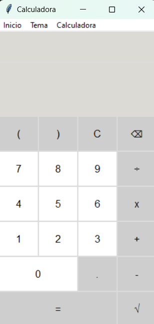

# MenuCalculadora

<<figure>
  

    
    <figcaption>Calculadora</figcaption>
  

</figure>

## Descripción
Calculadora con la capacidad de realizar tanto operaciones básicas, como suma, resta, división y multiplicación, como operaciones más avanzadas, entre ellas, radicación, mínimo común múltiplo (MCM), máximo común divisor (MCD), factorial y valor absoluto.

