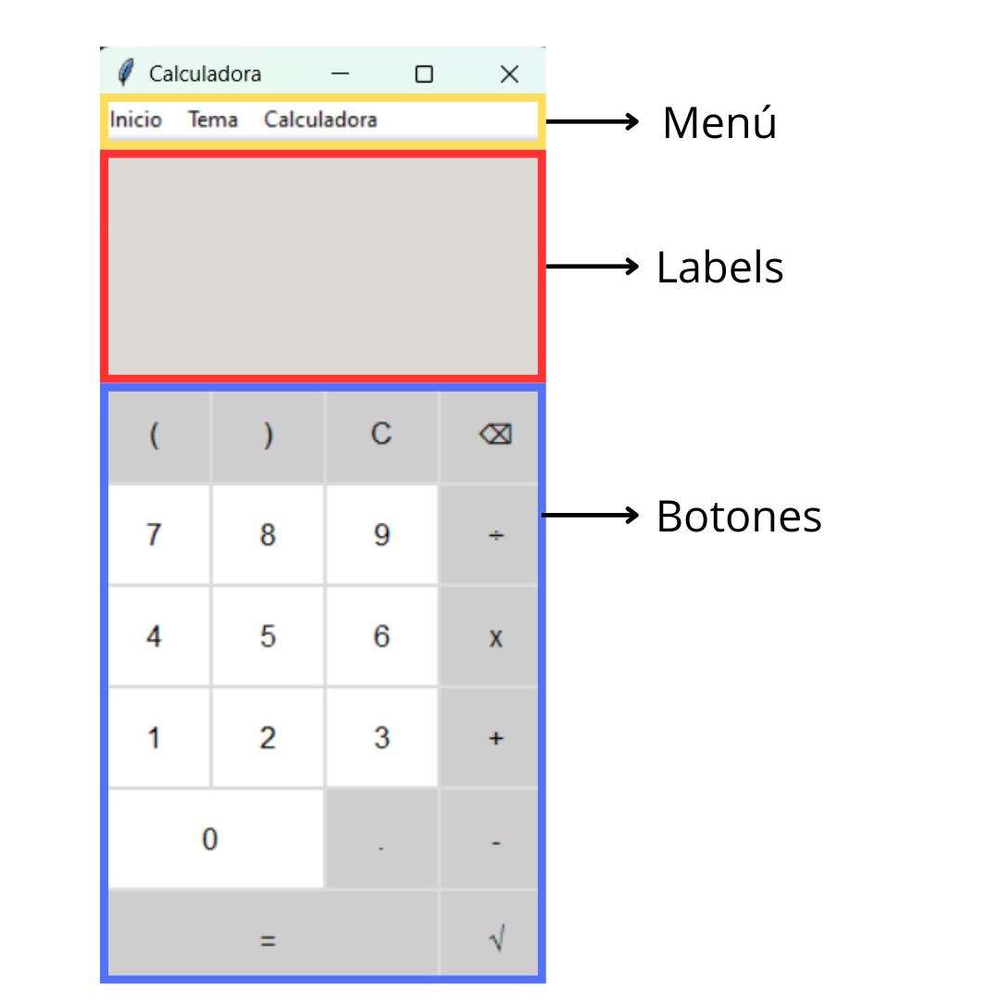
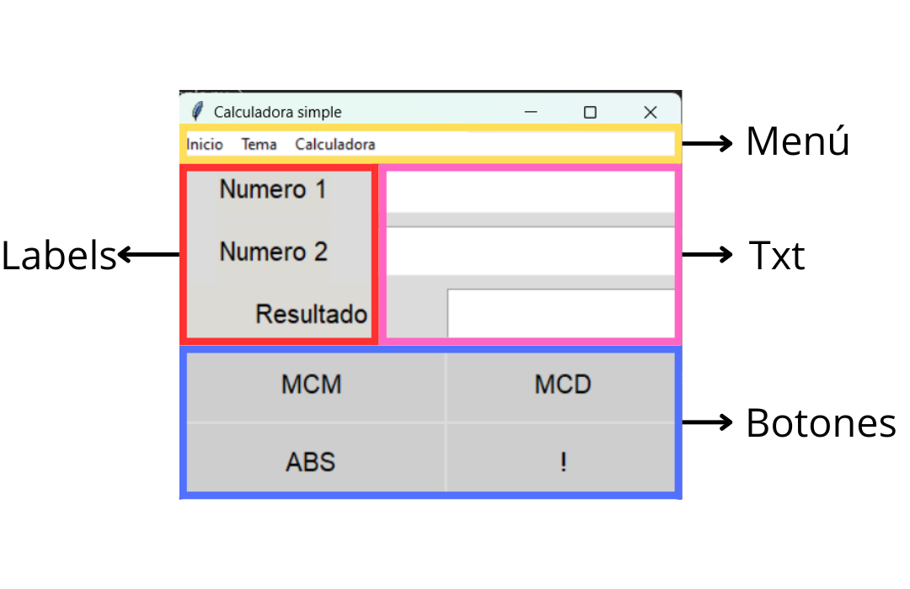

# MenuCalculadora

<figure style="text-align: center;">
  
  <figcaption>Calculadora</figcaption>
</figure>

## Descripción
Calculadora con la capacidad de realizar tanto operaciones básicas (suma, resta, división y multiplicación) como operaciones más avanzadas (radicación, mínimo común múltiplo (MCM), máximo común divisor (MCD), factorial y valor absoluto).

## Índice
1. [Descripción](#descripción)
2. [Instalación](#instalación)
3. [Herramientas Utilizadas](#herramientas-utilizadas)
4. [Uso](#uso)
5. [Estructura del Código](#estructura-del-código)
    - [Calculadora](#calculadora)
        - [Barra de Menú](#barra-de-menú)
        - [Bloque de Labels](#bloque-de-labels)
        - [Bloque de Botones](#bloque-de-botones)
    - [Calculadora_simple.py](#calculadora_simplepy)
        - [Barra de Menú](#barra-de-menú)
        - [Bloque de Labels](#bloque-de-labels)
        - [Bloque de Botones](#bloque-de-botones)
        - [Bloque de Texto](#bloque-de-texto)
6. [Requisitos](#requisitos)
7. [Licencia](#licencia)
8. [Autor](#autor)

## Descripción

- *Interfaz de usuario*: La calculadora utiliza la biblioteca estándar de Tkinter y ttk para crear una interfaz elegante y funcional.
- *Operaciones*: Puedes realizar operaciones básicas como suma, resta, división y multiplicación, así como radicación desde la interfaz o teclado. En la interfaz de "Calculadora simple" se pueden realizar operaciones más avanzadas como MCM, MCD, factorial y valor absoluto.
- *Diseño*: La calculadora tiene un botón en el menú superior llamado "Tema" para cambiar entre un modo claro y un modo oscuro.
- *Botón de salida*: El botón de salida se encuentra en el menú principal dentro de "Inicio", dedicado a cerrar el programa fácilmente.
- *Botón de calculadora*: Permite navegar entre las dos calculadoras.

## Instalación

1. Asegúrate de tener Python 3.11 o superior instalado en tu sistema.
2. Instala Git si aún no lo tienes.
3. Clona el repositorio desde GitHub con el siguiente comando:
    bash
    git clone https://github.com/Mogollo7/MenuCalculadora.git
    

## Herramientas Utilizadas

- *Tkinter*: Biblioteca estándar para crear interfaces gráficas en Python.
- *ttk*: Módulo de Tkinter que proporciona widgets adicionales para mejorar la apariencia.
- *subprocess*: Módulo para ejecutar comandos del sistema y gestionar procesos.
- *math*: Módulo que proporciona funciones matemáticas adicionales.

## Uso

Al iniciar calculadora.py, podrás cambiar el tema, salir y cambiar a Calculadora_simple.py desde la barra superior. En Calculadora.py, puedes ingresar valores reales para operaciones básicas y realizar radicación ingresando el número y luego presionando el botón de raíz cuadrada. Puedes operar la calculadora desde la interfaz o desde tu teclado. Para borrar una entrada, presiona b, y para borrar todo, presiona q. Puedes cambiar esta configuración modificando el valor en el código:
  python
  ventana.bind('<KeyPress-b>', borrar)
  ventana.bind('<KeyPress-q>', borrar_todo)

En Calculadora_simple.py, podrás realizar operaciones avanzadas como MCM, MCD, factorial y valor absoluto desde la interfaz, además de cambiar el tema y navegar a calculadora.py sin problemas.

## Estructura del Código

El código se compone de dos componentes principales: Calculadora.py y Calculadora_simple.py.

### Calculadora
## Funciones de Cálculo

1. *Operaciones*: Implementa operaciones como suma, resta, multiplicación, división y radicación.
 factorial y valor absoluto.
2. *Temas*: Permite cambiar entre un tema claro y un tema oscuro.
3. *Menú*: Incluye un menú para navegar entre Calculadora_simple.py y Calculadora.py, y para salir del programa.

### Barra de Menú

La barra de menú incluye botones que permiten realizar diversas acciones en la calculadora. Entre ellos se encuentran los botones para operar el ejecutador del programa, acceder a la interfaz de Calculadora_simple.py, y salir del programa. También cuenta con un botón para cambiar entre los temas claro y oscuro, proporcionando una experiencia de usuario más personalizable y cómoda.

### Bloque de Labels

El bloque de labels está diseñado para mostrar información relevante durante el uso de la calculadora. *Label 1* se encarga de mostrar las operaciones anteriores realizadas, mientras que *Label 2* muestra las operaciones actuales en curso. Esto facilita el seguimiento de las operaciones y resultados en tiempo real.

### Bloque de Botones

El bloque de botones de la calculadora está compuesto por varios tipos de botones. Incluye botones para realizar las operaciones matemáticas básicas y avanzadas, botones numéricos para introducir valores, y botones de borrado que permiten limpiar entradas específicas o resetear la calculadora. Esta disposición asegura que el usuario tenga acceso fácil y rápido a todas las funcionalidades necesarias.

<figure style="text-align: center;">
    
    <figcaption>Diagrama de la Calculadora</figcaption>
</figure>

### Calculadora_simple.py

Calculadora_simple.py está estructurado para proporcionar operaciones matemáticas avanzadas y opciones de personalización de la interfaz. Incluye las siguientes características:

1. *Funciones de Cálculo*: Implementa operaciones como MCM, MCD, factorial y valor absoluto.
2. *Temas*: Permite cambiar entre un tema claro y un tema oscuro.
3. *Menú*: Incluye un menú para navegar entre Calculadora_simple.py y Calculadora.py, y para salir del programa.

### Barra de Menú

La barra de menú incluye botones que permiten realizar diversas acciones en la calculadora. Entre ellos se encuentran los botones para operar el ejecutador del programa, acceder a la interfaz de Calculadora_simple.py, y salir del programa. Además, cuenta con un botón para cambiar entre los temas claro y oscuro, proporcionando una experiencia de usuario más personalizable y cómoda.

### Bloque de Labels

El bloque de labels está diseñado para mostrar información específica durante el uso de la calculadora. Los labels son los siguientes:

- *Label "Número 1"*: Muestra el primer número ingresado por el usuario. Este label permite al usuario ver claramente cuál es el primer número en la operación.
- *Label "Número 2"*: Muestra el segundo número ingresado por el usuario. Facilita la revisión del segundo número que se usará en la operación matemática.
- *Label "Resultado"*: Muestra el resultado de la operación realizada. Proporciona una forma clara de ver el resultado final del cálculo.

### Bloque de Labels

El bloque de botones está compuesto por varias categorías de botones. Incluye botones para realizar operaciones matemáticas avanzadas como el Mínimo Común Múltiplo (MCM), el Máximo Común Divisor (MCD), factorial y el valor absoluto. 

### Bloque de Texto

El bloque de texto en la interfaz es donde los usuarios ingresan los números y ven los resultados de las operaciones. Este área proporciona un espacio interactivo para introducir los números necesarios para los cálculos y observar cómo se actualizan los resultados en tiempo real.

<figure style="text-align: center;">
    
    <figcaption>Diagrama de la Calculadora</figcaption>
</figure>

## Requisitos

- Python 3.11+
- Tkinter (generalmente viene preinstalado con Python en la mayoría de las distribuciones)

## Licencia

Este proyecto está licenciado bajo la MIT License.

## Autor
[Juan Sebastián Martínez Galeano](https://github.com/Mogollo7?tab=repositories)